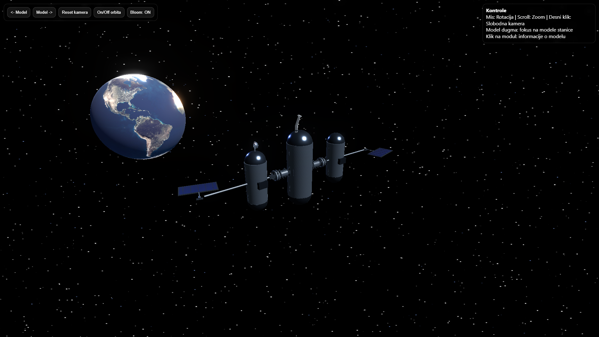
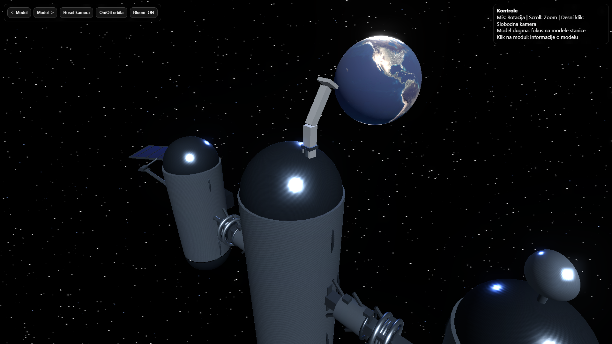
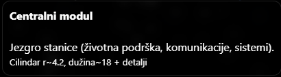

# Space Station Viewer (Three.js)

An interactive **3D space station scene** built with **Three.js**, featuring a modular codebase, smooth camera “tour” navigation, clickable module info, and postprocessing bloom.

## Live Demo
- **Demo URL:** _TODO: add your deployed link (GitHub Pages / Vercel / Netlify)_

## Screenshots
Add your screenshots to `public/screenshots/` and update the links below:

| Scene | Preview |
|------|---------|
| Full station |  |
| Tour focus (module) |  |
| Clickable info panel |  |

> Tip: take screenshots at 1920×1080 for best results.

## Features
- Orbit controls (rotate / zoom / pan)
- Procedural starfield background
- Postprocessing **Bloom** toggle (ON/OFF)
- Camera “Tour” between key points (smooth lerp)
- Click on modules → info panel (raycasting)
- Animations: station orbit, solar panel motion, Earth rotation, antenna spin, robot arm movement
- Clean, split architecture (UI, renderer setup, materials, station builder, postprocess, animation loop)

## Tech Stack
- **Three.js**
- **OrbitControls**
- **EffectComposer + UnrealBloomPass**
- Recommended bundler: **Vite**

## Project Structure
```text
src/
  main.js
  config.js
  ui.js
  threeSetup.js
  background.js
  materials.js
  earth.js
  tour.js
  interaction.js
  postprocess.js
  resize.js
  animate.js
  station/
    buildStation.js
    helpers.js
public/
  textures/
  screenshots/   (optional)
```

## Getting Started (Vite)
1) Install dependencies:
```bash
npm install
```

2) Run locally:
```bash
npm run dev
```

3) Build for production:
```bash
npm run build
```

4) Preview the production build:
```bash
npm run preview
```

## Controls
- **Mouse drag:** rotate
- **Scroll wheel:** zoom
- **Right mouse drag:** pan
- **Tour buttons:** focus camera on station modules
- **Click on a module:** show module details

## Textures
This project expects textures under `public/textures/`, for example:
- `public/textures/metal_basecolor.png`
- `public/textures/metal_normal.png`
- `public/textures/metal_roughness.png`
- `public/textures/solar_basecolor.png`
- `public/textures/solar_normal.png`
- `public/textures/earth/earth_atmos_2048.jpg`
- `public/textures/earth/earth_normal_2048.jpg`
- `public/textures/earth/earth_lights_2048.png`

If you change paths or names, update them in `src/materials.js` and `src/earth.js`.

## Deployment (GitHub Pages - Vite)
One simple approach is to deploy the `dist/` output to GitHub Pages.

1) Set your Vite `base` path in `vite.config.js`:
```js
export default {
  base: "/YOUR_REPO_NAME/",
};
```

2) Build:
```bash
npm run build
```

3) Deploy:
- Option A: use `gh-pages`:
  ```bash
  npm i -D gh-pages
  npx gh-pages -d dist
  ```
- Option B: GitHub Actions (recommended). Create a workflow that builds and publishes `dist/` to Pages.

Then paste your URL into the **Live Demo** section at the top.

## Notes
- The scene uses postprocessing bloom; if performance is an issue, reduce bloom strength or disable it by default.
- `station/buildStation.js` returns references used by tour/animation; this keeps the animation loop clean and centralized.

## License
Choose a license (MIT is common) and add it here.
